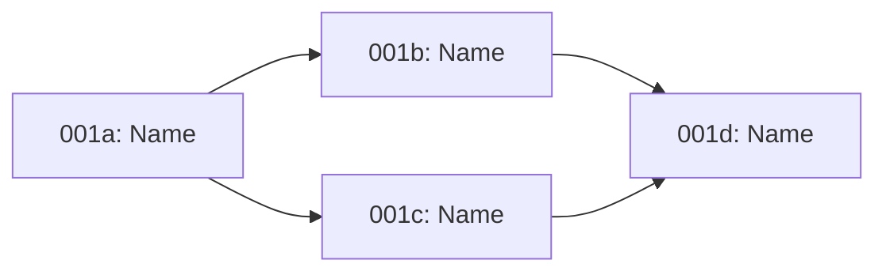

# [Feature Name] - Breakdown

**Author:** [Name]
**Date:** [YYYY-MM-DD]
**Status:** Draft | In Review | Approved
**Parent TDD:** `./docs/features/<NNN>-<feature-name>.tdd.md`

---

## 1. Overview

Brief summary of how this feature will be broken down and why.

### Slicing Strategy
[Layer / User Story / Integration / Risk - explain the approach]

---

## 2. Sub-Features

### 001a - [Sub-Feature Name]

| Aspect | Details |
|--------|---------|
| **Scope** | What this sub-feature delivers |
| **Parent TDD Sections** | §2.1, §4.2, etc. |
| **Dependencies** | None / 001b must complete first |
| **Estimated Size** | S / M / L |

**Includes:**
-

**Excludes:**
-

---

### 001b - [Sub-Feature Name]

| Aspect | Details |
|--------|---------|
| **Scope** | What this sub-feature delivers |
| **Parent TDD Sections** | §3.1, §5, etc. |
| **Dependencies** | Requires 001a |
| **Estimated Size** | S / M / L |

**Includes:**
-

**Excludes:**
-

---

### 001c - [Sub-Feature Name]

| Aspect | Details |
|--------|---------|
| **Scope** | What this sub-feature delivers |
| **Parent TDD Sections** | §6, etc. |
| **Dependencies** | Requires 001a, 001b |
| **Estimated Size** | S / M / L |

**Includes:**
-

**Excludes:**
-

---

## 3. Dependency Graph

---

## 4. Implementation Order

| Phase | Sub-Feature | Rationale |
|-------|-------------|-----------|
| 1 | 001a | Foundation / No dependencies |
| 2 | 001b | Builds on 001a |
| 3 | 001c, 001d | Can be parallel |

---

## 5. Risk Assessment

| Sub-Feature | Risk Level | Mitigation |
|-------------|------------|------------|
| 001a | Low/Med/High | |
| 001b | Low/Med/High | |

---

## 6. Open Questions

| # | Question | Answer |
|---|----------|--------|
| 1 |          |        |

---

## Sign-off

- [ ] Sub-features are independently testable
- [ ] Sub-features are independently deployable
- [ ] Dependencies are clear
- [ ] Ready for `/engineer` on first sub-feature

---

## Next Steps

1. Clear context window
2. Run `/engineer` for sub-feature **001a**
3. Continue sequence: `/test-design` → `/coder` → `/code-review` → `/qa`
4. Repeat for each sub-feature in order
