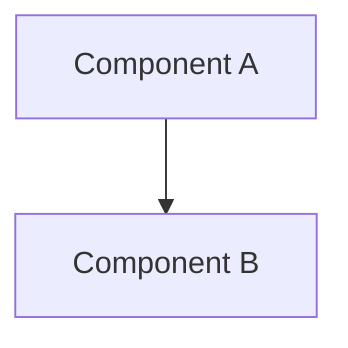

# [Feature Name] - Technical Design Document

**Author:** [Name]  
**Date:** [YYYY-MM-DD]  
**Status:** Draft | In Review | Approved  
**Feature Spec:** `./docs/features/<NNN>-<feature-name>.feature.md`

---

## 1. Overview

Brief summary of what we're building and why.

## 2. Architecture

### 2.1 Affected Modules

| Module | Changes |
|--------|---------|
|        |         |

### 2.2 Component Diagram



### 2.3 Module Boundaries

| Module | Exposes (Public API) | Consumes |
|--------|---------------------|----------|
|        |                     |          |

## 3. Data Model

### 3.1 Entities

```typescript
interface Entity {
  id: string;
  // ...
}
```

### 3.2 Database Changes

- [ ] New tables
- [ ] Altered tables
- [ ] Migrations required

## 4. API Design

### 4.1 Endpoints / Methods

```typescript
// POST /api/resource
interface CreateResourceInput {
  name: string;
}

interface CreateResourceOutput {
  id: string;
  createdAt: Date;
}
```

### 4.2 Authentication

- 

## 5. Error Handling

### Domain Errors

| Error Class | When Thrown | Data Included |
|-------------|-------------|---------------|
|             |             |               |

## 6. External Integrations

| Service | Purpose | Centralized In |
|---------|---------|----------------|
|         |         |                |

## 7. Performance Considerations

- [ ] N+1 queries addressed
- [ ] Pagination implemented
- [ ] Caching strategy defined

## 8. Security Considerations

- 

## 9. Migration / Rollout Plan

- [ ] Feature flag needed?
- [ ] Database migrations?
- [ ] Backwards compatible?
- [ ] Rollback plan?

## 10. Open Questions

| # | Question | Answer |
|---|----------|--------|
| 1 |          |        |

---

## Sign-off

- [ ] Architecture reviewed
- [ ] Ready for Test Design (`/test-design`)
